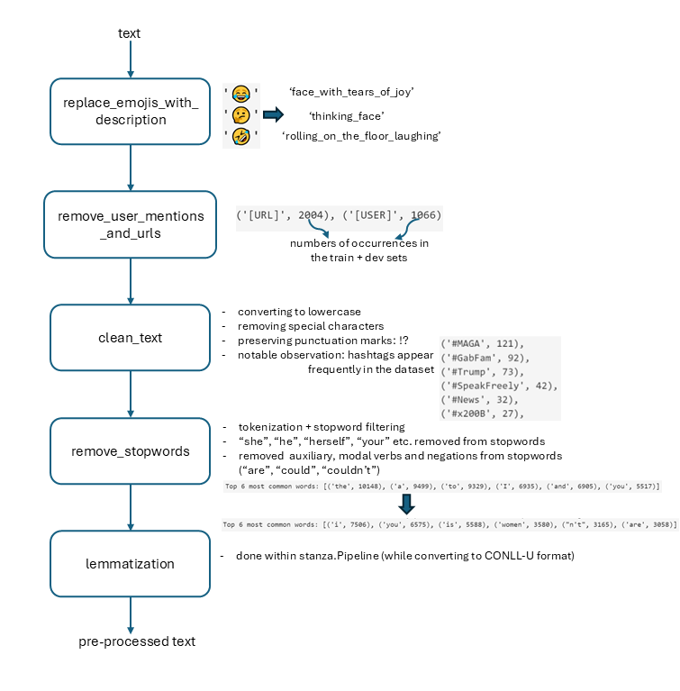

# NLP_24W_VSHJ
Topic: Detection of Online Sexism

Students: Sofija Milicic, Henry Werner Forman, Vanja Draganic, Johannes Pfennigbauer

We are using Python 3.10. The necessary packages can be found in `requirements.txt`.

#### Milestone 1
Note: The `data` folder contains 2 datasets: one with individual labels from 3 annotators per comment and another aggregated version, where 2/3 agreements were resolved by the dataset creators. For preprocessing, we used only the aggregated dataset to avoid redundant processing. The presence of 2/3 agreements will be revisited during the error analysis in milestone 2.

A detailed exploratory analysis, including text normalization steps and explanations for the preprocessing decisions, is documented in `milestone 1/milestone_1.ipynb`. The entire preprocessing workflow, including conclusions from the analysis and conversion to the standard CoNLL-U format, is implemented in the `TextProcessingPipeline` class, located in the script `milestone 1/pipeline_connl.py`. The dataset, exported in the standard format and split into training, test, and validation sets, is available in the `data/processed` folder.

Outlined below is a diagram of the preprocessing steps implemented in the `TextProcessingPipeline` class.

#### Milestone 2

All relevant code is located in the `milestone 2` folder, which includes:

1. `milestone_2.ipynb` - a notebook inside which various baseline models are trained and tested, results are summarized and qualitative analysis is conducted
2. `import_preprocess.py` - with `ImportPreprocess` class whose methods handle reading CoNLL-U files, balancing the dataset and extracting features (BoW and TF-IDF)
3. `baseline_models.py` - defines separate classes for various baseline models, all of which inherit evaluation and qualitative analysis methods from the abstract base class `ClassificationModel`
4. `preprocess_input.py` - provides a function for preprocessing input sentences in the same way as in `milestone 1/pipeline_connl.py`, but without generating CoNLL-U files. This was implemented with the aim of testing the models with the sentences we come up with, to examine how they're classified

Baseline models that we implemented:

a) traditional (non-DL)

1. Majority Class - ` MajorityClassClassifier` class
2. Rule-based (regex) - `RuleBasedClassifier` class
3. Naive Bayes - `NaiveBayesClassifier` class
4. Logistic Regression - `LogisticRegression` class
5. XGBoost (using BoW/TF-IDF features) - `XGBoostClassifier` class

b) DL baseline models

1. LSTM - `LSTM_Model` class

The dataset is imbalanced, so in `milestone_2.ipynb`, all models are trained using both the original dataset and the balanced version. Metrics: accuracy, balanced accuracy, precision and recall are tracked and presented alongside confusion matrices in each case. The `Results` section of the notebook provides a summary of the outcomes for both scenarios: training with balanced and unbalanced data for each model tested.

`Qualitative/error analysis` was performed to thoroughly assess the quality and limitations of the baseline models' predictions, as well as to inspire us with ideas for improvement. The analysis primarily focuses on the LSTM and Naive Bayes models. Functionalities that we implemented:

1. randomly sampling sentences from each of the 4 corners of confusion matrix (TN, FP, FN, TP) and examining them alongside individual labels from 3 annotators
2. extracting the most frequently occurring tokens for each of the 4 corners of the confusion matrix
3. identifying the most common tokens in the context of a specified fixed token
4. testing the models on custom sentences

Baseline models offer a solid starting point but have notable limitations. They struggle to capture context, deeper semantic meaning, sarcasm or implicit sexism. Despite balancing efforts, they remain biased toward the majority class and show limited generalizability, relying heavily on explicit patterns and word frequencies.